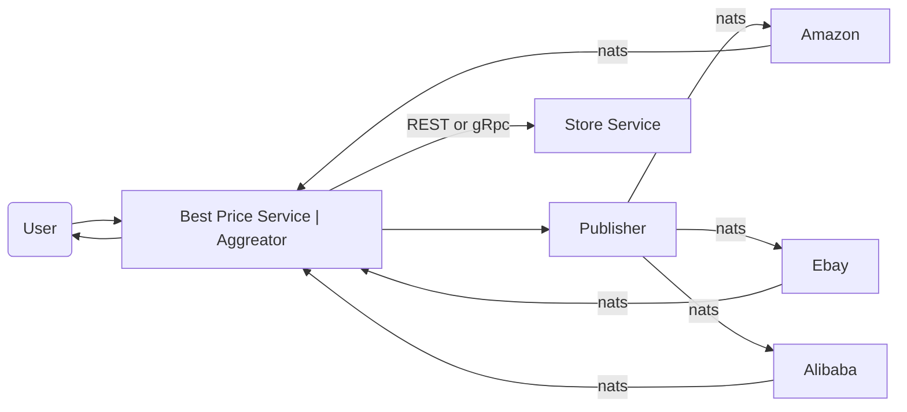
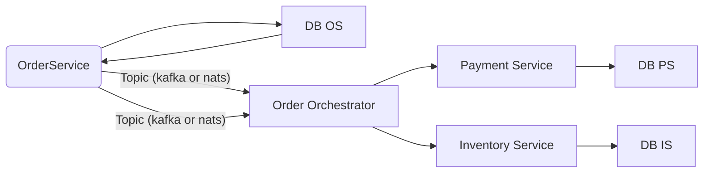
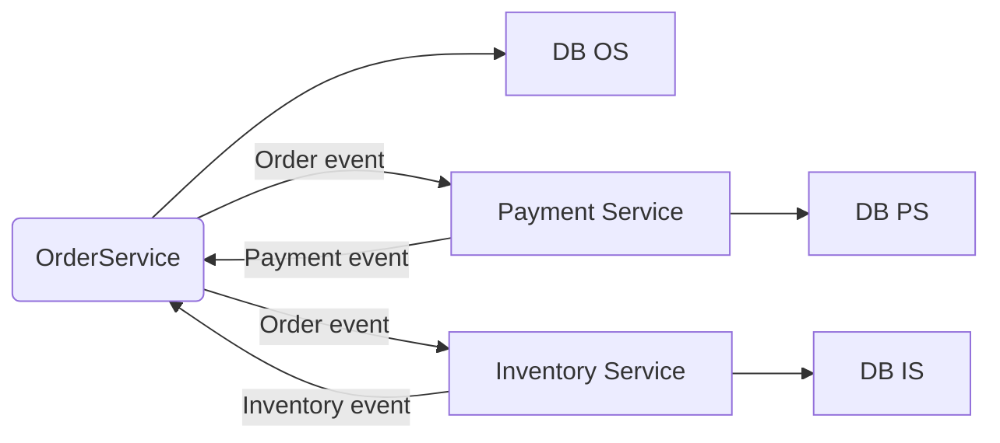

# Saga pattern
Example implementation of saga pattern with "annessi&connessi". An incremental tutorial

## Scatter&Gather
Very usefull design patterns, it's applicable in the case you've many task that can be executed in parallel than data is collected and composite result is returned.

Main "Enterprise Integration Patterns for the distributed system architecture"

### Solution
* BestPriceService is implemented using scatter-gather design.
  * It uses a publisher that sends via flow messages to price providers (multiple implementation of PriceProviderService) 
    * NB: in real scenario a hexagonal architecture with port/gates should be a good solution)
  * Then data is collected into an aggregator that gives info to service and returns to user
* NB: DTOs are collected in "common" module this is a questionable approach because it creates coupling between services Check http://www.vinsguru.com/microservices-architecture-how-to-share-dto-data-transfer-objects/ for a deep 
  * Suggested idea is to create 2 subprojects for every microservice: ms-client and ms-server, first one with dto, second one with logic. Server and all other services that should call it includes client, so dto are available with no duplication
  * My consideration is that you can collect all one in common prj, divided by package. Some MS will include no needed data (bad practice) but it's much more agile
* Communications with service is provided by [NATS](https://nats.io/about/) technology, using jnat library
* After completed best price is stored to Store Service via gRPC & Protobuf call
  * I've created both REST (for sync) and Grpc implementation (in async call). Spring-grpc-starter creates a new server for managing it
  * Protobuf uses a .proto file that defines contract. Then server and client stubs will be generated (multiple languages supported)
  * In this solution proto is store on common module so generated DTO and stubs are by-there available. Transformer are also provided (handmade, MapStruct should be used)

Steps:
1. implements dto in common, Item DTO and objects for request and response
2. implements vendor service. Data is computed and set over NATS server channel, also create docker file for release. Test depends on testcontaines for creating onthefly nats server.
3. implements search service. An async and sync version is provided. Testing is complicated due to external services dependency.
## Problem
We implement the pattern to solve a typical problem:

Microservices env:
* Order Service
* Payment Service
* Inventory Service

NB: Any of it has its own DB. Order is complete if and only if both payment and inventory completes successfully, if one ot that fails both should roll back

Solutions:
* Orchestration approach: we've a separate service that orchestrate transaction, if everything is ok it marks order ok, otherwise it's cancelled.
* Choreography approach: problem is solved basing on event-sourcing. Events can be accepted or rejected in a centralized way so no extra service is needed. Take a look to [CQRS](https://github.com/cmauri75/cqrs)

### Orchestration way
We create a separate service, which will be coordinate transactions on all microservices. If everything finishes fine, it marks the order-request completed, otherwise it calls rollbacks

Idea is that you take money from credit card, then get item from inventory. If everything is ok order is stored on local DB, otherwise everything is rollbacked.

Steps:
1. Create dto in common package for data transfer. Should be defined using contract, in this case are direct written for using with REST
2. Create payment and inventory services, with also rollback endpoint  
3. Create order service that stores order and then calls orchestrator service (Note: tests call are mocked via WireMock)
   1. NB: nats is used in queue subscribe mode so non problem if multiple instances are present will occur
4. Create orchestrator:
   1. Define a WorkFlow that is a list of WorkflowSteps than can execute or revert and have a WorkflowStepStatus --> Pending, completed or failed
   2. Both Inventory and Payments have their steps, so implement. 
      1. NB: Reactive calls should be preferable, sync one are here used for simplicity
   3. After execution check results and in case of errors revert
[Open point] what if one rollback fail?

### Choreography way
In this case no additional service are needed, but it relies on event-sourcing.

Order service send an order event and both Payment and Inventory services are listening for it.

Order is in CREATED state, OrderService receive results and then commit the order state or rollbacks 

