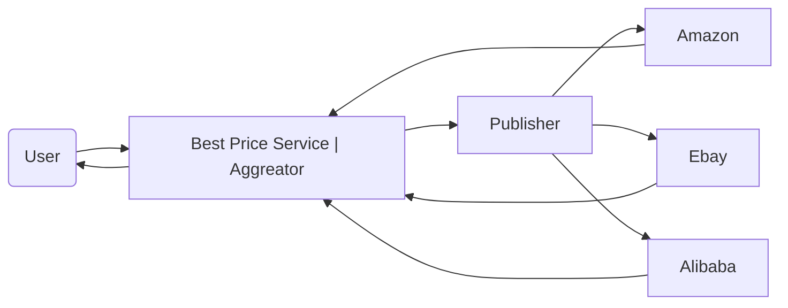

# Saga pattern
Example implementation of saga pattern with "annessi&connessi". An incremental tutorial

## Scatter&Gather
Very usefull design patterns, it's applicable in the case you've many task that can be executed in parallel than data is collected and composite result is returned.

Main "Enterprise Integration Patterns for the distributed system architecture"

### Solution
* BestPriceService is implemented using scatter-gather design.
  * It uses a publisher that sends via flow messages to price providers (multiple implementation of PriceProviderService) 
    * NB: in real scenario an exagonal architecture with port/gates should be a good solution for uniformation )
  * Than data is collected into an aggregator that gives info to serivce and returns to user
* NB: DTOs are collected in "common" module this is a questionable approach because it creates coupling between services, but for optimization purposes it's a good idea, optimal for tutorial cases.
* Comunications with service is provided by [NATS](https://nats.io/about/) technology, using jnat library

Steps:
1. implements dto in common, Item DTO and objects for request and response
2. implements vendor service. Data is computed and set over NATS server channel, also create docker file for release. Test depends on testcontaines for creating onthefly nats server.
3. implements search service. An async and sync version is provided. Testing is complicate due to external services dependency.
## Problem
We implement the pattern to solve a typical problem:

Microservices env:
* Order Service
* Payment Service
* Inventory Service

NB: Any of it has it's own DB. Order is complete if and only if both payment and inventory completes successfully, if one ot that fails both should rollback

Solutions:
* Orchestration approach: we've a separate service that orchestrate transaction, if everything is ok it marks order ok, otherwise it's cancelled.
* Choreography approach: problem is solved basing on event-sourcing. Events can be accepted or rejected in a centralized way so no extra service is needed. Take a look to [CQRS](https://github.com/cmauri75/cqrs)
